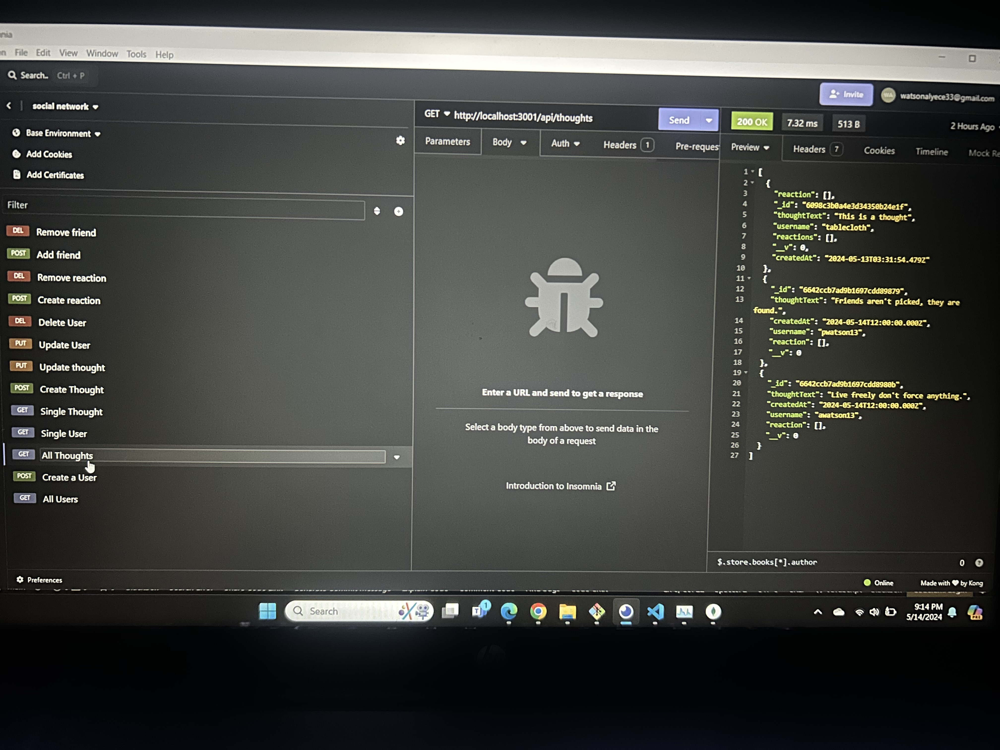

# Social-Network-API

## Description.

NoSQL Social Network API is a Node.js application programming interface (API) that allows users to perform CRUD operations on social networking data models using a NoSQL database. The data models include users, friends, thoughts, and reaction data models, and they can be retrieved by ID or by all. This API is built using Node.js and Mongoose, and it provides a simple way to handle social networking data without the restrictions of traditional relational databases.

## Table of Contents:
- [Description](#description)

- [Live-Screen-Recording-of-Application-Functionality](#live-screen-recording-of-application-functionality)

- [Screenshots](#screenshots)

- [Technologies-Used](#technologies-used)

- [Installation](#installation)

- [License](License)

- [Questions](#questions)

## Technologies Used

This application is powered by Node.js, Express.js, JavaScript, MongoDB, and Mongoose (ODM). It utilizes the node package manager (npm) dependencies express, mongoose, and Nodemon was utilized as a devDependency allowing the server to refresh when edits were made to application.  MongoDB Compass acted as a interactive use to visually see the database. The Insomnia application, was utilized to test the functionality of routes within the program.

## Screenshots
 

## Installation

1. Clone the repo:
   git clone git@github.com:Watsonaj0316/Social-Network-API.git

2. Once node.js is installed, in the terminal, utilize the command npm init -y to initialize and create a package.json where project files will be stored.

3. Next, use the terminal to run the command npm i to install the dependencies associated with this application (developers may need to install dependencies directly from the command line).

   Commands to install each dependency:

   - Command for express will be npm i express
   - Command for mongoose will be npm i mongoose
   - Command for nodemon will be npm i nodemon
   

4. Next, you will want to make sure you have access to a MongoDB account and MongoDB Compass, these will allow you to interact with the database and visually confirm what changes are being made in the database. (Link for MongoDB & MongoDB Compass download -> https://coding-boot-camp.github.io/full-stack/mongodb/how-to-install-mongodb).

5. Once all dependencies are installed, you will then be able to run the command npm start from the root directory to spin up the server. With nodemon installed, you will also be able to utilize the command npm run dev 

6. From there, you can utilize applications such as Insomnia to test the functionality of the API routes within the program and make edits to the code base (Link to install Insomnia -> https://docs.insomnia.rest/insomnia/install).

## License

## Questions

Have additional questions? Click the links below to reach me through my GitHub account or Email address.

[Link to Github](https://github.com/Watsonaj0316)

Email:watsonalyece33@gmail.com